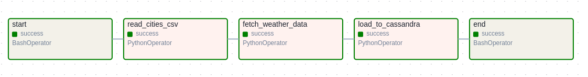
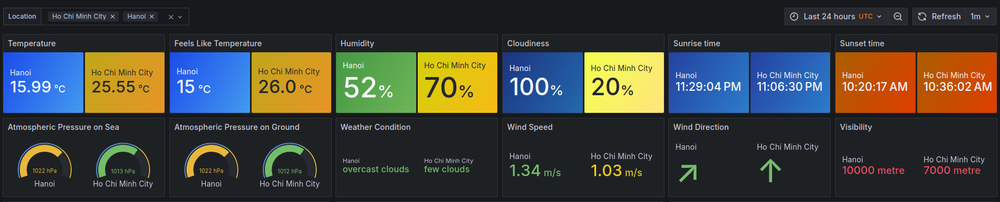
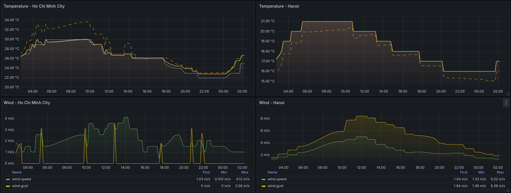

# Weather Data Pipeline

This project collects weather data from cities in South East Asia using the OpenWeather API and processes the data using Apache Airflow. The data is then stored in a Cassandra database and visualized through Grafana dashboards.

## Project Structure

```
cassandra/              # Cassandra-related scripts
├── data-model          # Cassandra data modelling scripts
├── scripts             # Query for creating keyspace "weather" on Cassandra

config/                 # Configuration folders
├── project.cfg         # Configuration variables for sensitive data

dags/                   # Airflow DAGs for managing the ETL pipeline
├── weather_dag.py      # Main DAG for fetching and processing weather data

data/                   # Data files and configurations
├── cities.csv          # List of cities with latitude and longitude
├── countries.csv       # List of countries

diagrams/              # Diagrams illustrating pipeline architecture

.env                    # Environment variables for sensitive data
.gitignore              # Git ignore file for excluding unnecessary files
Dockerfile              # Dockerfile for containerizing the application
docker-compose.yaml     # Docker Compose file to set up the environment
requirements.txt        # Python dependencies for the project
```

## Setup and Installation

### Prerequisites
1. Install [Docker](https://www.docker.com/).
2. Install [Docker Compose](https://docs.docker.com/compose/).

### Steps
1. Clone the repository:
   ```bash
   git clone git@github.com:ntrg1317/weather-pipeline.git
   cd weather-pipeline
   ```

2. Set up the `project.cfg` file with the required environment variables:
   ```env
   [OPENWEATHERMAP]
   API_KEYS=["key1", "key2"]
   
   [DATA]
   DATA_FILE_PATH=/opt/airflow/data/cities.csv
   
   [ASTRA]
   SECURE_CONNECT_BUNDLE=<your_secure_bundle>
   ASTRA_CLIENT_ID=<your_client_id>
   ASTRA_CLIENT_SECRET=<your_client_secret>
   ASTRA_KEYSPACE="weather"
   
   [SPARK]
   SPARK_MASTER=spark://spark-master:7077
   APP_NAME=

   ```

3. Build and start the containers:
   ```bash
   docker composer up --build
   ```

4. Access the services:
   - Airflow: [http://localhost:8080](http://localhost:8080)
   - DataStax: Create database name weather-cluster then download bundle zip and token for config file
   - Grafana: Install plugin Astra DB on Grafana then connect to cluster

## Pipeline Workflow

1. **Start Task**: Logs the start of the pipeline.
2. **Read Cities CSV**: Reads city data from `data/cities.csv`.
3. **Fetch Weather Data**: Fetches weather data from the OpenWeather API for each city.
4. **Load to Cassandra**: Stores the processed data into a Cassandra table.
5. **End Task**: Logs the completion of the pipeline.



## Project Diagram

Below is a visual representation of the pipeline architecture:


## Grafana Dashboard

The Grafana dashboard visualizes the following metrics:
- Temperature trends for cities
- Humidity levels
- Wind speed and directions
- Real-time weather conditions

To configure the dashboard:
1. Connect Grafana to your Astra database using a suitable connector.
2. Import pre-built panels or create custom visualizations based on the stored data.

Some images of the dashboard:


